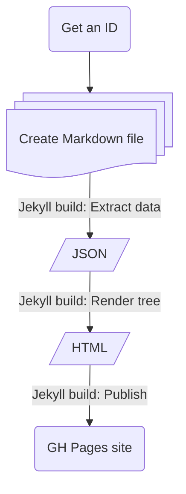

# Roots and branches

---

To see an example, with 3 generations of ascendants and descendants, click **[Family tree](tree.md)**.

---

## Process

1. Get an ID from a controlled list (for example, a CSV file).
2. Create Markdown files with frontmatter and content.
3. Run an SSG build. The following artifacts are generated, one after the other:
   1. JSON file, with data extracted from the Markdown files.
   1. HTML files, with JS logic and CSS styling.
   1. Static website, with interactive HTML.
   

---

## Technical details

See the [GitHub README](https://github.com/AninditaBasu/roots-and-branches).

---
