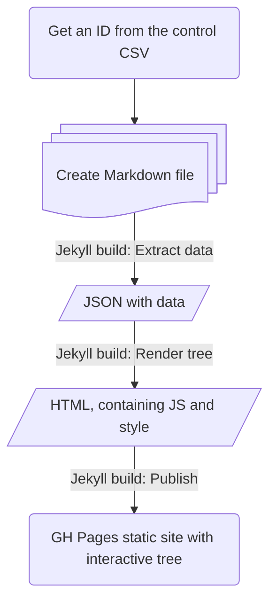

# Roots and branches

To see an example rendering, where max. generations is 3, click **[Family tree](tree.md)**.

---

## Process

1. Get an ID from a controlled list (for example, a CSV file).
2. Create Markdown files with frontmatter and content.
3. Run an SSG build. The following artifacts are generated one after the other:
   1. JSON file, with data extracted from the Markdown files.
   1. HTML files, after reading the JSON data and applying JS logic and CSS styling.
   1. Static website, displaying the generated HTML with interactive elements.
   

## Technical details

See the [GitHub README](https://github.com/AninditaBasu/roots-and-branches).